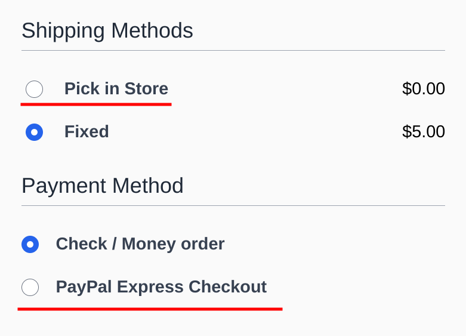
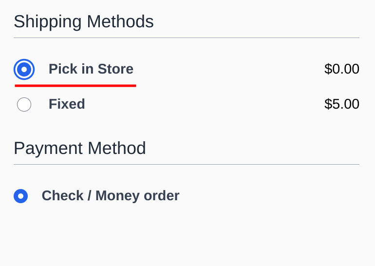
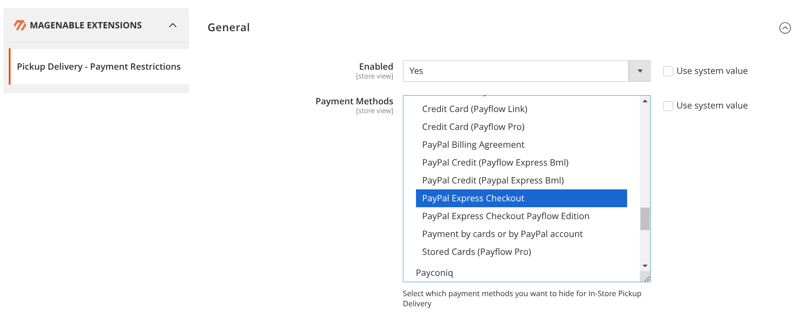

# In Store Pickup Delivery - Payment Restrictions (Hyvä Checkout)

This module allows you to restrict payment methods for In Store Pickup Delivery on Hyva checkout page.





## Installation

### Composer:

Run the following command in Magento 2 root folder

```
composer require magenable/module-pickup-payment-restriction
bin/magento setup:upgrade
bin/magento setup:di:compile
bin/magento setup:static-content:deploy
```
## Upgrade

### Composer:

Run the following command in Magento 2 root folder

```
composer update magenable/module-pickup-payment-restriction
bin/magento setup:upgrade
bin/magento setup:di:compile
bin/magento setup:static-content:deploy
```

## User Guide

### Configuration:

Go to **Stores** > **Settings** > **Configuration** > **Magenable Extensions** > **Pickup Delivery - Payment Restrictions**.

#### General

- `Enabled` - Enable or Disable the module
- `Payment Methods` - Select which payment methods you want to hide for In-Store Pickup Delivery



#### About developer
The extension is developed by Magenable (https://magenable.com.au), eCommerce consultancy specializing in Magento/Adobe Commerce based in Melbourne, Australia
